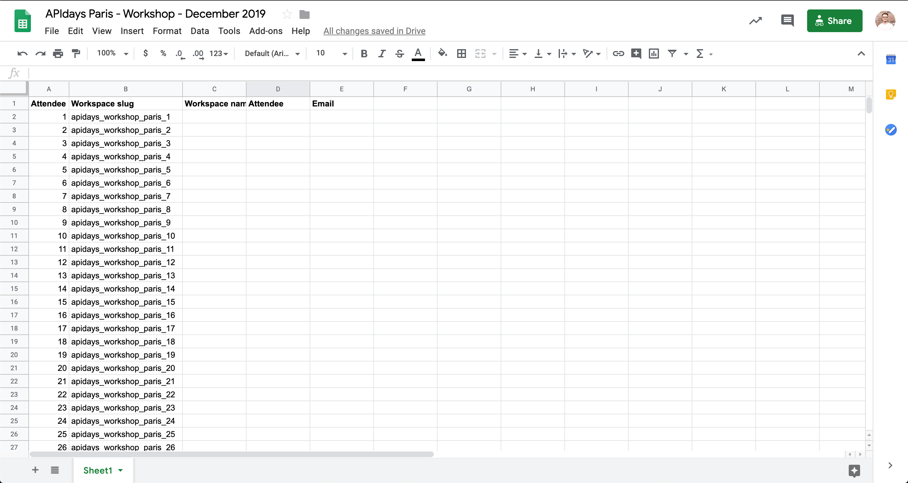
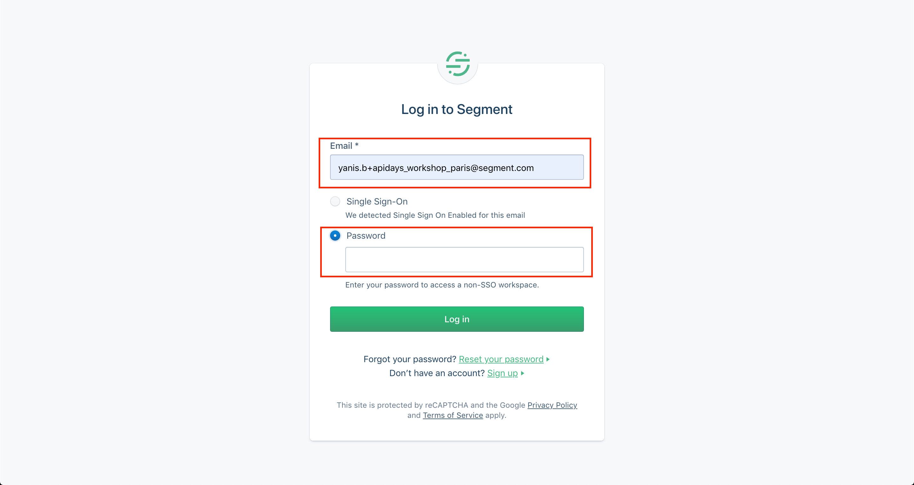
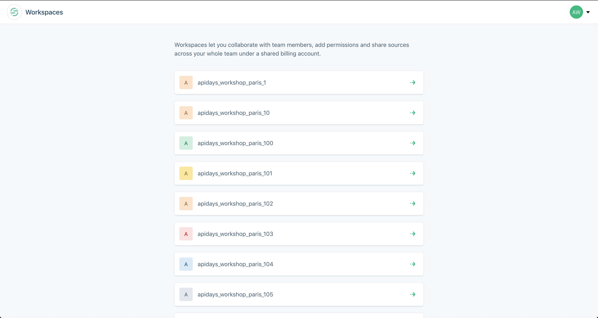
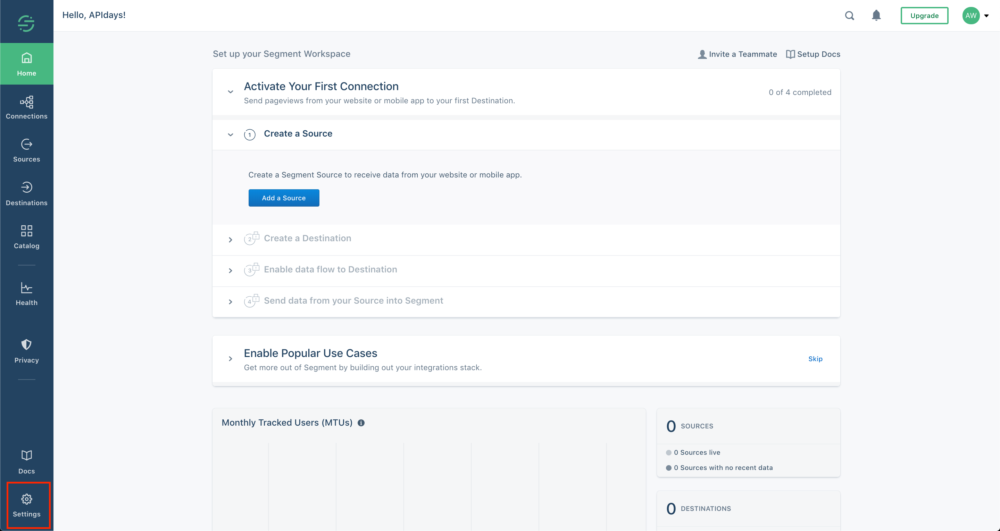
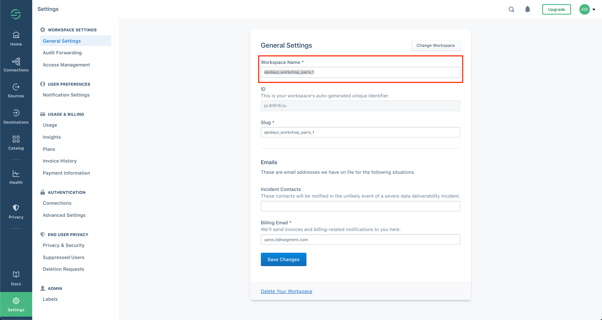
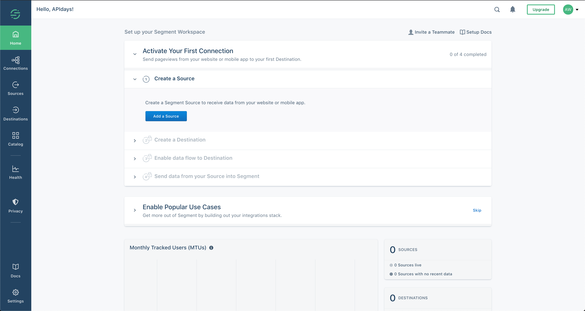
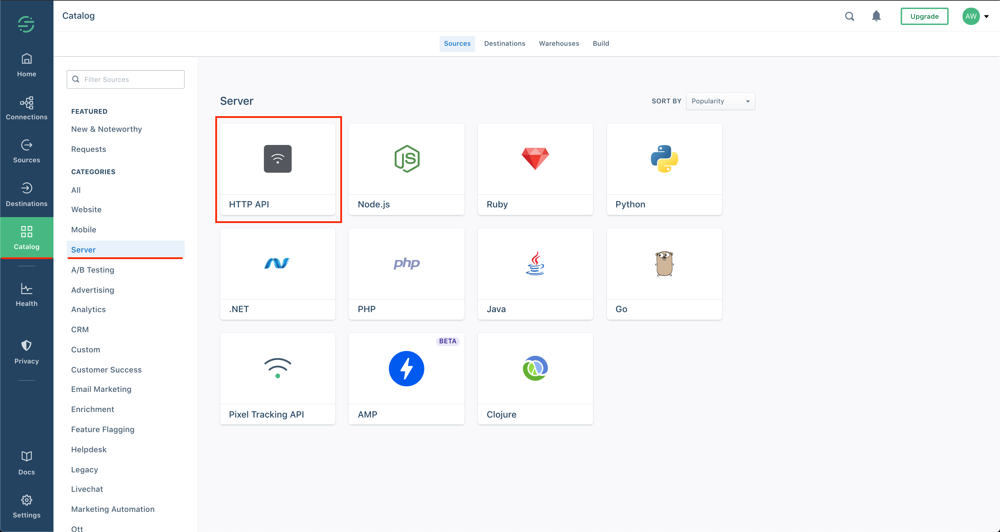
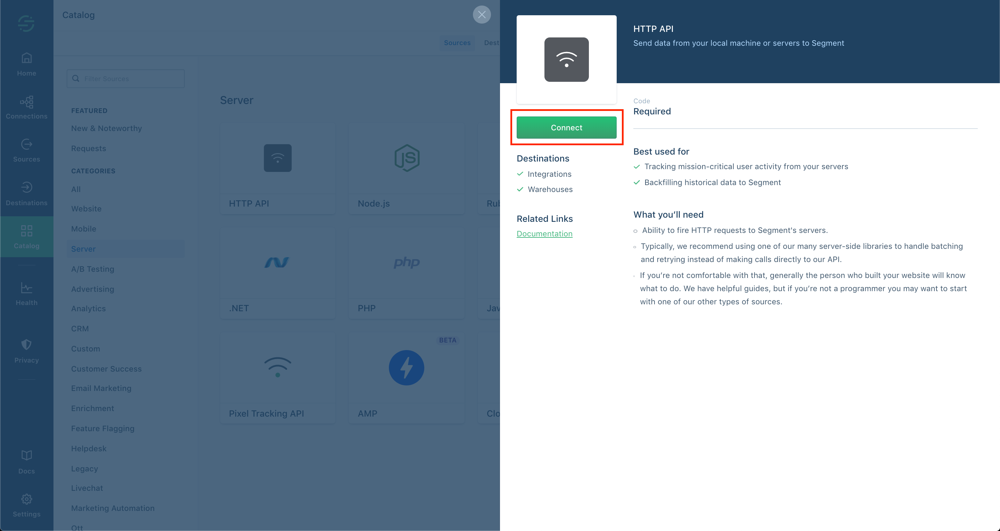
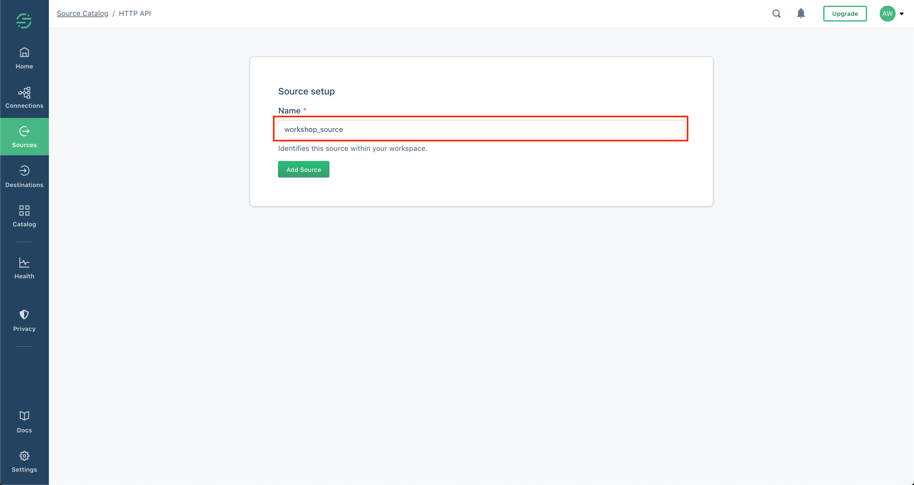
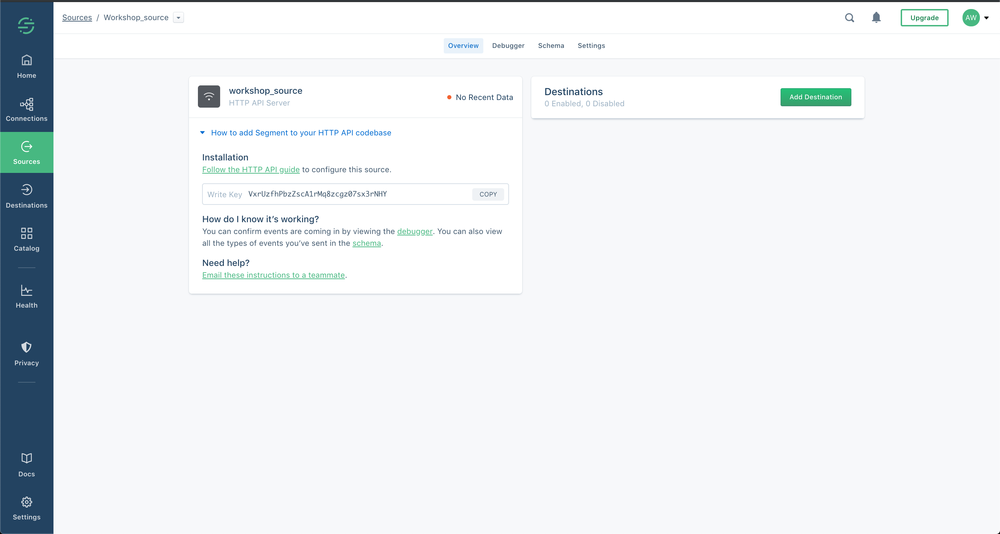

# Claiming your workspace and connecting a source
For the live workshop exercises, Segment has pre-provisioned workspaces for the workshop.  If you are doing this workshop after the live event, you will need a new workspace. If you do not have one, please contact your Segment sales representative at https://segment.com/contact/sales/.
To get your workshop workspace:
1. Open the Google Sheet at [Segment Workspaces](https://docs.google.com/spreadsheets/d/1Pltzg8kIOsLc4vaey1YtPnwDAPNduBnwwfswjxsL9m0/edit?ts=5dea759c#gid=0)
2. Find an unclaimed workspace
  
3. Claim your shiny new Segment workspace by putting your name in the appropriate fields, please.

## Part 1 - Set up Your Segment Workspace
After you have claimed your workspace, there are a couple of steps you need to follow to get it ready to start the workshop.
1. Go to [https://app.segment.com](https://app.segment.com/).
2. Make sure you select the “Password” login radio button.
3. Log in as:
```
username: yanis.b+apidays_workshop_paris@segment.com
password: <available at the workshop>
```
  
4. Click the “Log In” button.  
5. Find the workspace name you claimed in the spreadsheet.  
6. Click the tile with the name you claimed.  
  
7. Click on the Settings gear in the bottom left corner of the screen that appears.
  
8. Change the name of the workspace to something you will remember, so that you can find your workspace more easily in case you have to log back in during or after the workshop.   
9. Click the “Save Changes” button.
  

## Part 2 - Create Segment Source
Segment Sources allow you to collect semantic events as your users interact with your web sites, mobile applications, or server-side applications. For this workshop, you will set up an HTTP source!  
Your initial Segment workspace will look like this:
  
You will need to add an HTTP source, using the ‘Add Source’ button in the screen shot above. To set up a source:

  

  

Please enter "workshop_source" as the source name. It'll be used as part of the request URLs we will be making in exercise 2.
  

Once your source is configured, it will appear in your workspace like this:
  


## [>>> onwards to exercise 1](exercise1.md/)