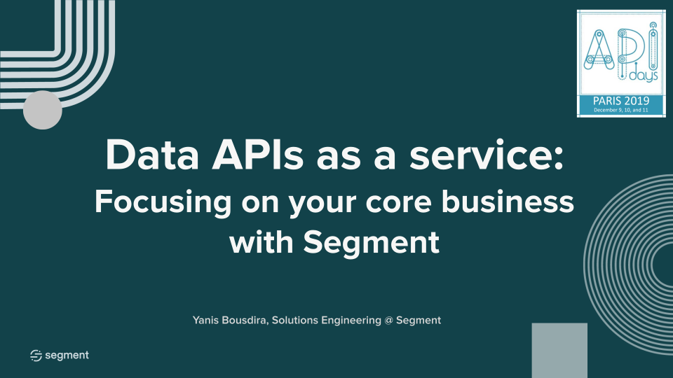

# Data APIs as a service: Focusing on your core business

Many collection APIs exist out ther in the wild. Some focus on real-time and others queue messages and release them in a cron-job style fashion. The power of APIs is almost endless, but the ease of use comes with one drawback: __Every tool has an API!__ The overall expansion of technology and software that consumes Customer Data in one way or another has put a tremendous strain on developers and marketers, where the need to instrument n amount of APIs with all their nuances and intracecies is causing bottle-necks and technical debt. Questions like "Where are the docs for this?" or statements such as "Let's check what StackOverflow says about this." are becoming more present and at this point a developer might need to "know" 5-25 different APIs besides the work they are already doing. Segment aims to overcome this by providing and API first design to the customer data problem and turn your collection of APIs into a service, ultimately allowing you to focus on your core business.

[Segment](http://segment.com) provides an easy way to collect data once about what users are doing and send the data to third party tools and warehouses. Segment does this by enabling businesses to collect first-party event data from their websites, mobile apps, and cloud tools like email and CRM, combine with offline data, then standardize and clean the data so it can be utilized in 200+ tools like marketing, analytics, attribution, and warehouses including Amazon Redshift.

[Segment * APIdays](https://events.segment.com/api-days-paris-2019) You know your core business depends on customer data. To help teams better understand customers, how many times do you use APIs to connect one tool to internal service to another tool? What other services have you built to support those connections? Join this workshop to build out your own APIs as a service for customer data.

Key takeaways include:

- Hooking up martech and analytics tools
- Collecting customer event and object data
- Scaling and supporting data pipelines


## Workshop Setup
Before following the exercises below, please download [Postman](https://www.getpostman.com/downloads/) and clone this repo for the Postman [environment](postman_info/postman_environment.json) & [request collection](postman_info/postman_collection.json).

```bash
git clone https://github.com/yabrira/apidays-workshop.git
```

If you would like to use cURL or do not have admin persissions to install applications, you can find the raw requests [here](). Please keep in mind that varriables will need to be replaced with your workspace information, that includes access_token, workspace_number & base64 encoded write key. If you are looking for a way to base64 encode, consider [base64encode.org/](https://www.base64encode.org/).

## [Preparation](preparation.md/) - Claiming your workspace and connecting a source
The focus of this [exercise](preparation.md/) is to claim your workspace and to set up an HTTP source within the workspace. You will claim your workspace for yourself and we will walk through the process of configuring Segment to receive data an incoming HTTP request.

## [Exercise 1](exercise1.md/) - Ingesting data via HTTP and verifying your data
In this [exercise](exercise1.md/) we will pick up where we left off in the prior exercise by submitting a batch request into your HTTP source and verifying the accuracy of the data via our live debugger.

## [Exercise 2](exercise2.md/) - Configuring a downstream data consumer programmatically
In this final [exercise](exercise2.md/) use Segment's APIs to configure Google Analytics and Braze as downstream data consumers. 

